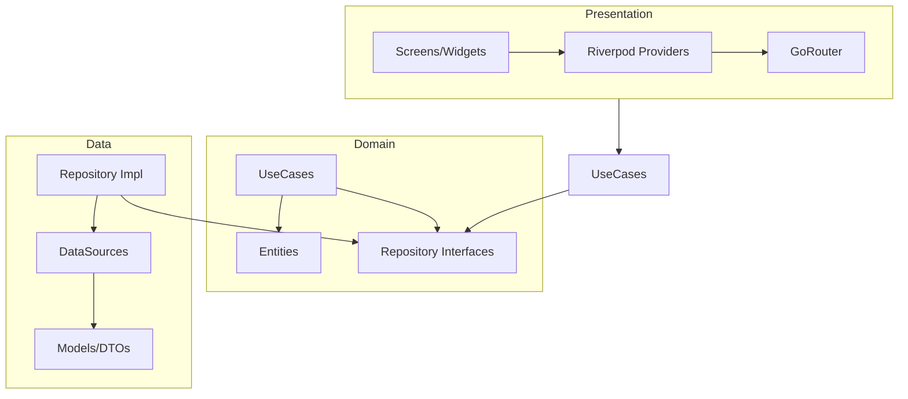

# 📋 Flutter App Board

[](https://flutter.dev)
[](https://opensource.org/licenses/MIT)

현대적인 **클린 아키텍처(Clean Architecture)**를 적용한 Flutter 게시판 어플리케이션입니다. 사용자 인증, 게시판 탐색, 무한 스크롤 게시글 목록, HTML 렌더링 기반 상세 페이지 및 통합 검색 기능을 제공합니다.

---

## ✨ Features

- **🔐 사용자 인증**: JWT 기반의 안전한 로그인 시스템 (Flutter Secure Storage 활용).
- **📋 게시판 관리**: 카테고리별 게시판 탐색 및 관리.
- **📑 게시글 리스트**: Shimmer 로딩 효과가 적용된 페이지네이션 기반 무한 스크롤.
- **📄 게시글 상세**: HTML 형식의 본문 렌더링 및 외부 브라우저 연동.
- **🔍 통합 검색**: 제목/본문 기반 검색 및 로컬 최근 검색어 저장.
- **🛠 외부 도구 연동**: 구글 스프레드시트 등 외부 업무 시스템과의 유기적인 연결.

---

## 📂 Project Structure

본 프로젝트는 백엔드와 프런트엔드가 긴밀하게 연동되는 구조로 설계되었습니다.
별도 github 저장소에 백엔드, 프런트엔드(WEB) 프로젝트가 있습니다.
https://github.com/coreline-ai/python_simple_saas_fullstack

### 🐍 Backend (Flask Web Server)
백엔드는 Flask 프레임워크를 기반으로 핵심 비즈니스 로직, 데이터베이스 관리 및 API 서비스를 제공합니다.

- **`app/`**: 메인 패키지
  - `__init__.py`: 앱 초기화, 블루프린트 및 익스텐션 설정.
  - `models.py`: SQLAlchemy 기반 DB 모델 정의 (User, Post, Board 등).
  - `views/`: 기능별 API 및 웹 로직 (Auth, Admin, API 등).
- **`migrations/`**: DB 마이그레이션 변경 이력.
- **`config.py`**: 개발/운영 환경 설정.
- **`wsgi.py`**: 서비스 배포를 위한 엔트리 포인트.

### 📱 Frontend (Flutter Mobile App)
프런트엔드는 사용자 인터페이스를 렌더링하고 사용자의 입력을 백엔드 API와 연결하여 처리합니다.

- **Architecture**: **Clean Architecture**
  - **`lib/data/`**: 데이터 레이어
    - `datasources/`: 원격(Remote) 및 로컬(Local) 데이터 소스 통신.
    - `models/`: JSON 직렬화를 위한 데이터 모델 (DTO).
    - `repositories/`: 도메인 레포지토리 인터페이스의 구체적 구현.
  - **`lib/domain/`**: 도메인 레이어 (영향 받지 않는 순수 비즈니스 레이어)
    - `entities/`: 핵심 데이터 비즈니스 객체.
    - `usecases/`: 특정 기능 단위의 비즈니스 오퍼레이션.
    - `repositories/`: 데이터 레이어와의 통신을 위한 추상 인터페이스.
  - **`lib/presentation/`**: 프레젠테이션 레이어
    - `providers/`: Riverpod 기반의 상태 관리 및 의존성 주입.
    - `screens/`: 화면 단위 위젯 구성.
    - `router/`: GoRouter 기반 네비게이션 관리.

---

## 🏗 Architecture Concept


- **Presentation Layer**: UI 구성 및 `Riverpod`을 이용한 상태 관리.
- **Domain Layer**: 핵심 비즈니스 로직 (`UseCase`) 및 추상 인터페이스.
- **Data Layer**: `Dio`를 이용한 API 통신 및 데이터 모델링 (`Freezed`).

---

## 🛠 Tech Stack

- **State Management**: `hooks_riverpod`, `flutter_hooks`
- **Navigation**: `go_router`
- **Networking**: `dio`
- **Serialization**: `freezed`, `json_serializable`
- **UI/UX**: `google_fonts` (Noto Sans KR), `shimmer`, `flutter_html`
- **Local Storage**: `flutter_secure_storage`, `shared_preferences`

---

## 🚀 Getting Started

### Prerequisites

- Flutter SDK (^3.7.2)
- Dart SDK (^3.0.0)

### Installation

1. 저장소 클론:
   ```bash
   git clone https://github.com/your-repo/flutter_app_board.git
   cd flutter_app_board
   ```

2. 종속성 설치:
   ```bash
   flutter pub get
   ```

3. 코드 생성 (Freezed & JsonSerializable):
   ```bash
   flutter pub run build_runner build --delete-conflicting-outputs
   ```

4. 앱 실행:
   ```bash
   flutter run
   ```

---

## 📄 License

This project is licensed under the MIT License - see the [LICENSE](LICENSE) file for details.

---

## 🤝 Contributing

1. Fork it (https://github.com/your-username/repo/fork)
2. Create your feature branch (`git checkout -b feature/fooBar`)
3. Commit your changes (`git commit -am 'Add some fooBar'`)
4. Push to the branch (`git push origin feature/fooBar`)
5. Create a new Pull Request
